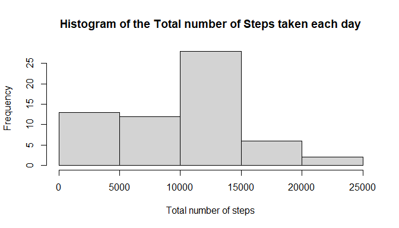
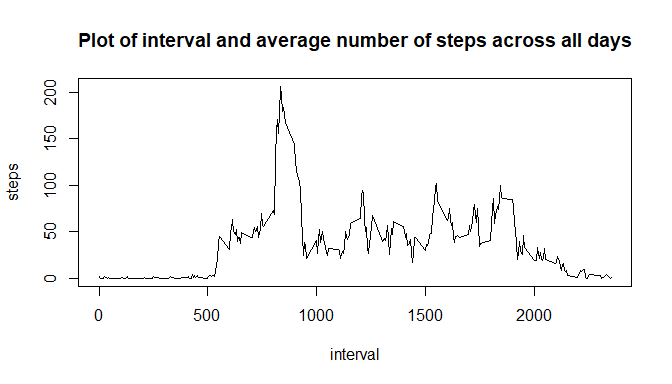
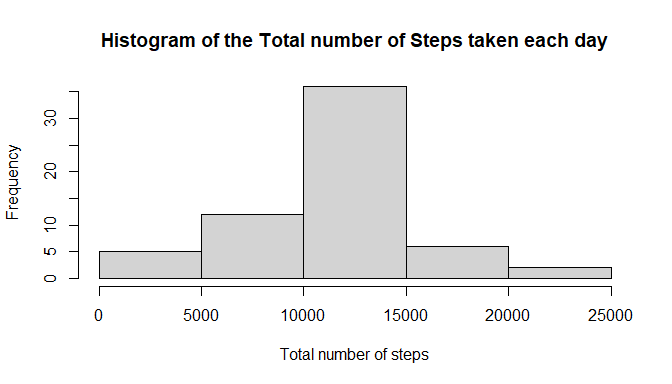
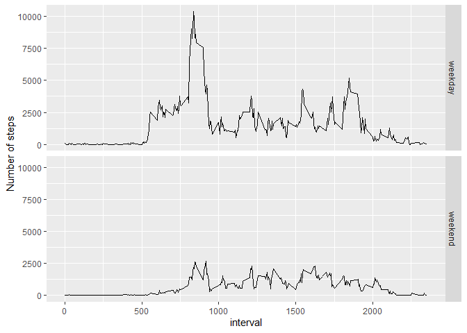

## Loading and preprocessing the data
Loading required package

```r
library(ggplot2)
library(dplyr)
```

```
## 
## Attaching package: 'dplyr'
```

```
## The following objects are masked from 'package:stats':
## 
##     filter, lag
```

```
## The following objects are masked from 'package:base':
## 
##     intersect, setdiff, setequal, union
```
Checking for zip file in working directory

```r
fileName <- "activity.zip"
fileUrl <- "https://d396qusza40orc.cloudfront.net/repdata%2Fdata%2Factivity.zip"
if(file.exists(fileName)){
  } else {
    download.file(fileUrl, getwd(), method="curl")
  }
```

```
## NULL
```
Unzipping the file

```r
unzip(fileName)
```
loading dataset

```r
activity <- read.csv("activity.csv")
```
processing data

```r
activity <- transform(activity, date = as.Date(date,format="%Y-%m-%d"))
```
## What is mean total number of steps taken per day?
Grouping the variable(step) by date to calculate averages

```r
SummarySteps <- activity %>% group_by(date) %>% 
        summarize(TotalSteps=sum(steps,na.rm=TRUE)) 
```
A histogram of the total number of steps taken each day

```r
with(SummarySteps, hist(TotalSteps, main="Histogram of the Total number of Steps taken each day", xlab="Total number of steps"))
```

<!-- -->

The mean and median total number of steps taken per day

```r
meanTotalsteps <- (mean(SummarySteps$TotalSteps))
medianTotalsteps <- (median(SummarySteps$TotalSteps))
```
The mean and median total number of steps taken per day are 9354.2295082 and 10395 respectively

## What is the average daily activity pattern?
Grouping the variable(step) by interval to calculate average number of steps

```r
StepsInterval <- activity %>% group_by(interval) %>% summarize(steps=mean(steps,na.rm=TRUE))
```
A time series plot of the 5-minute interval and the average number of steps taken, averaged across all days.

```r
with(StepsInterval,plot(interval,steps,type="l",main="Plot of interval and average number of steps across all days"))
```

<!-- -->

```r
maxStepsInterval <- StepsInterval$interval[which.max(StepsInterval$steps)]
```
The 835 interval on average contains the maximum number of steps across all the days in the dataset.

## Imputing missing values

```r
TotalNAs <- sum(is.na(activity$steps))
```
The total number of missing values in the dataset is 2304

Function to return a particular interval mean step for a given interval

```r
returnMeanIntervalSteps <- function(interval){
StepsInterval[StepsInterval$interval == interval,]$steps
}
```
Creating new dataset with NAs filled in

```r
activityNoNAs <- activity
```
Replacing NAs with interval mean steps

```r
for(i in 1:nrow(activityNoNAs)){
    if(is.na(activityNoNAs[i,]$steps)){
        activityNoNAs[i,]$steps <- returnMeanIntervalSteps(activityNoNAs[i,]$interval)
    }
}
```
Grouping the variabes to calculate average

```r
SummaryStepsNoNAs <- activityNoNAs %>% group_by(date) %>% 
  summarize(TotalSteps=sum(steps,na.rm=TRUE)) 
```
A histogram of the total number of steps taken each day

```r
with(SummaryStepsNoNAs,hist(TotalSteps, main="Histogram of the Total number of Steps taken each day", xlab="Total number of steps"))
```

<!-- -->

Calculating the mean and median total number of steps

```r
meanTotalstepsNoNAs <- (mean(SummarySteps$TotalSteps))
medianTotalstepsNoNAs <- (median(SummarySteps$TotalSteps))
```

The mean and median total number of steps taken per day are 9354.2295082 and 10395 respectively.
The mean and median estimates remain as the first part of the assignment

## Are there differences in activity patterns between weekdays and weekends?
Create new factor variable in dataset

```r
activityNoNAs<- transform(activityNoNAs, daysOfweek= factor(weekdays(activityNoNAs$date)))
levels(activityNoNAs$daysOfweek) <- list("weekday"=c("Monday","Tuesday","Wednesday","Thursday","Friday"), "weekend"=c("Saturday","Sunday"))
```
Grouping dataset to calculate average number of steps across weekdays and weekends

```r
summaryActivityNoNAs <- activityNoNAs %>% group_by(interval,daysOfweek) %>% summarize (TotalSteps=sum(steps))
```

```
## `summarise()` has grouped output by 'interval'. You can override using the `.groups` argument.
```
A time series plot of the 5-minute interval and the average number of steps taken, averaged across all weekday days or weekend days.

```r
ggplot(summaryActivityNoNAs,aes(interval,TotalSteps))+geom_line()+facet_grid(vars(daysOfweek))+ylab("Number of steps")
```

<!-- -->


